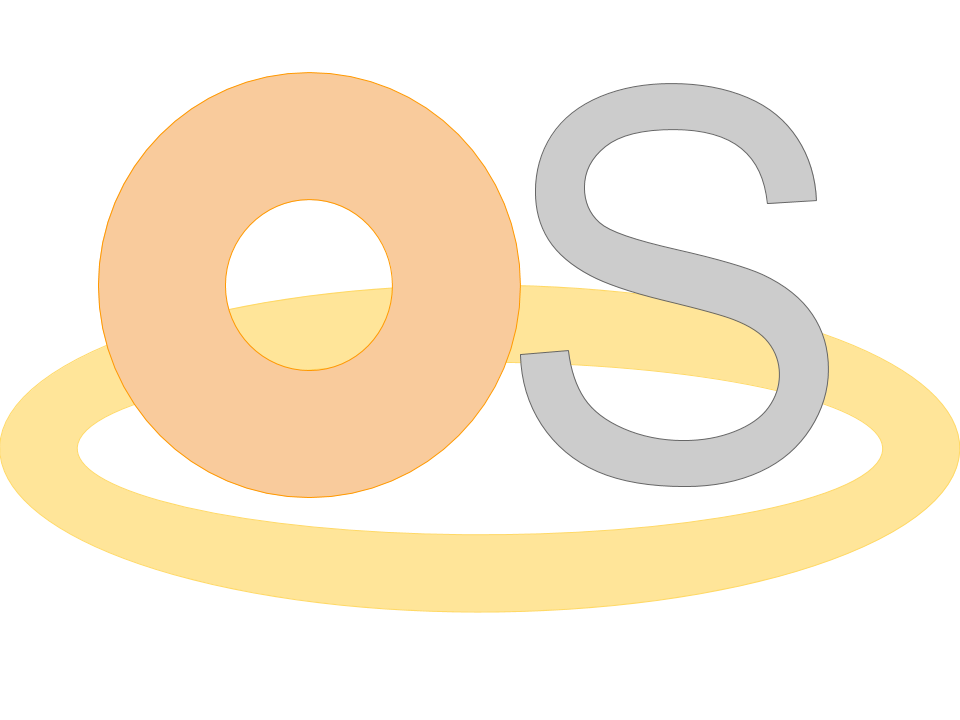

[![Contributors][contributors-shield]][contributors-url]
[![Forks][forks-shield]][forks-url]
[![Stargazers][stars-shield]][stars-url]
[![Issues][issues-shield]][issues-url]
[![MIT License][license-shield]][license-url]

<br />
<p align="center">
  <a href="https://github.com/Ved-P/CheeriOS">
    
  </a>

  <h3 align="center">CheeriOS</h3>

  <p align="center">
    A miniature application similar to an Operating System designed in Java to be run off of Java.
    <br />
    <a href="https://github.com/Ved-P/CheeriOS"><strong>Explore the docs »</strong></a>
    <br />
    <br />
    <a href="https://github.com/Ved-P/CheeriOS">View Demo</a>
    ·
    <a href="https://github.com/Ved-P/CheeriOS/issues">Report Bug</a>
    ·
    <a href="https://github.com/Ved-P/CheeriOS/issues">Request Feature</a>
  </p>
</p>

<details open="open">
  <summary>Table of Contents</summary>
  <ol>
    <li>
      <a href="#about-the-project">About The Project</a> <!--
      <ul>
        <li><a href="#built-with">Built With</a></li>
      </ul> -->
    </li>
    <li>
      <a href="#getting-started">Getting Started</a> <!--
      <ul>
        <li><a href="#prerequisites">Prerequisites</a></li>
        <li><a href="#installation">Installation</a></li>
      </ul> -->
    </li>
    <li><a href="#usage">Usage</a></li>
    <li><a href="#roadmap">Roadmap</a></li>
    <li><a href="#contributing">Contributing</a></li>
    <li><a href="#license">License</a></li>
    <li><a href="#contact">Contact</a></li>
    <li><a href="#acknowledgements">Acknowledgements</a></li>
  </ol>
</details>

## About The Project

<!-- [![Product Name Screen Shot][product-screenshot]](https://example.com) -->

Cheeri Operating System, or **CheeriOS** for short, is a simple application made in Java to emulate what an Operating System would look like. It is designed to be a friendly, customizable Operating System. It will include features that allow users to customize how their screen looks like for a comfortable layout. Furthermore, it will include a way for applications to be built into the Operating System. Many features are planned for CheeriOS, as follows:
* A File Manager
* A Browser
* A Terminal Window
* A File Editor designed for Coding
* More!

**Disclaimer:** CheeriOS is not a real Operating System for the following reasons:
* It does not connect harware to software applications.
* It does not include and operate with a low-level language.
* It is designed to be run in a different OS.

However, CheeriOS is designed to look like an Operating System, and maybe a precursor to a new Operating System coming soon!

<!--
### Built With
This section should list any major frameworks that you built your project using. Leave any add-ons/plugins for the acknowledgements section. Here are a few examples.
* [Bootstrap](https://getbootstrap.com)
* [JQuery](https://jquery.com)
* [Laravel](https://laravel.com)
-->

## Getting Started
This section will be added once the project gets going!
<!--
This is an example of how you may give instructions on setting up your project locally.
To get a local copy up and running follow these simple example steps.

### Prerequisites

This is an example of how to list things you need to use the software and how to install them.
* npm
  ```sh
  npm install npm@latest -g
  ```

### Installation

1. Get a free API Key at [https://example.com](https://example.com)
2. Clone the repo
   ```sh
   git clone https://github.com/your_username_/Project-Name.git
   ```
3. Install NPM packages
   ```sh
   npm install
   ```
4. Enter your API in `config.js`
   ```JS
   const API_KEY = 'ENTER YOUR API';
   ```
-->
## Usage
This section will be added once the project gets going!
<!-- Use this space to show useful examples of how a project can be used. Additional screenshots, code examples and demos work well in this space. You may also link to more resources.

_For more examples, please refer to the [Documentation](https://example.com)_ -->

## Roadmap
See the [open issues](https://github.com/Ved-P/CheeriOS/issues) for a list of proposed features (and known issues).

## Contributing
Contributions are what make the open source community such an amazing place to be learn, inspire, and create. Any contributions you make are **greatly appreciated**.

1. Fork the Project
2. Create your Feature Branch (`git checkout -b feature/AmazingFeature`)
3. Commit your Changes (`git commit -m 'Add some AmazingFeature'`)
4. Push to the Branch (`git push origin feature/AmazingFeature`)
5. Open a Pull Request

## License
Distributed under the MIT License. See `LICENSE` for more information.

## Contact
Ved Pradhan - vedprad1@gmail.com

Project Link: [https://github.com/Ved-P/CheeriOS](https://github.com/Ved-P/CheeriOS)

## Acknowledgements
* [Img Shields](https://shields.io)
* [Choose an Open Source License](https://choosealicense.com)

[contributors-shield]: https://img.shields.io/github/contributors/Ved-P/CheeriOS.svg?style=for-the-badge
[contributors-url]: https://github.com/Ved-P/CheeriOS/graphs/contributors
[forks-shield]: https://img.shields.io/github/forks/Ved-P/CheeriOS.svg?style=for-the-badge
[forks-url]: https://github.com/Ved-P/CheeriOS/network/members
[stars-shield]: https://img.shields.io/github/stars/Ved-P/CheeriOS.svg?style=for-the-badge
[stars-url]: https://github.com/Ved-P/CheeriOS/stargazers
[issues-shield]: https://img.shields.io/github/issues/Ved-P/CheeriOS.svg?style=for-the-badge
[issues-url]: https://github.com/Ved-P/CheeriOS/issues
[license-shield]: https://img.shields.io/github/license/Ved-P/CheeriOS.svg?style=for-the-badge
[license-url]: https://github.com/Ved-P/CheeriOS/blob/main/LICENSE
<!-- [product-screenshot]: images/cheerios-logo.png -->
